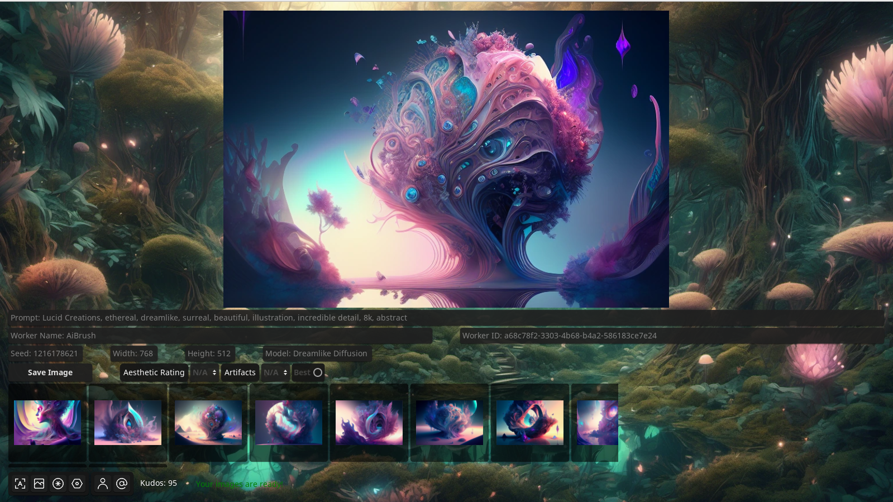

# Dreambox [v0.0.2](CHANGELOG.md)

 

# API Key

While you can use this software anonymously, by using the api_key '0000000000', depending on the load on the grid, this can take a while. If you [generate a unique api_key for yourself](https://aigrid.net/register) you can use it to join the grid with your own PC and receive kudos for generating for others, which will increase your priority on the grid.

# Generating

Type your prompt on the top and press generate. If you're looking for ideas, take a look at [lexica.art](https://lexica.art/)

Adjust your Generation setting on the controls side to suit your requirements.

# Contributing

This software is based on the crowdsourced processing power. If you feel the generations are taking too long, you can help make them faster by adding your own GPU to to the grid. [This process is more technical](https://github.com/Haidra-Org/AI-grid-Worker/blob/main/README.md) and involves installing python and more steps, but it's certainly doable without too much hassle. 

Reminder that you will always have priority on your own GPU, and you will also be accumulating Kudos to give you more priority to the rest of the grid.

# Community

Join us on [Discord](https://discord.gg/3DxrhksKzn)

## License

This software is licensed undel AGPL3. However [an addendum](ADDENDUM1) has been added to allow distribution via Steam and integration with Steamworks SDK.
